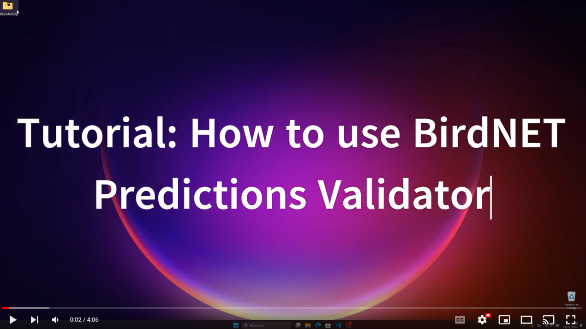
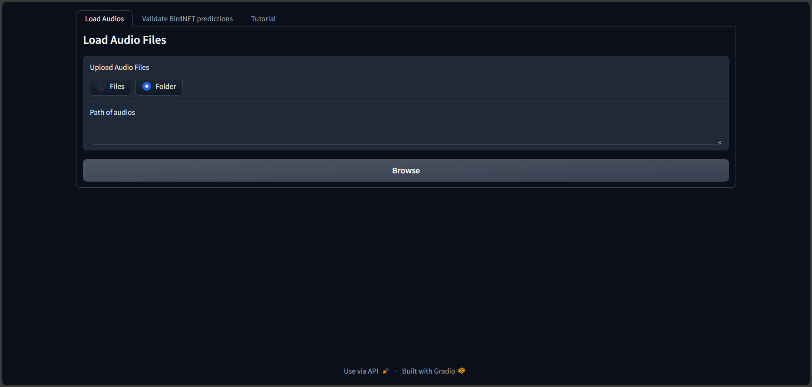

# BirdNET Predictions Validator App

BirdNET Predictions Validator App is a Gradio-based Python application designed to facilitate the validation of bird species predictions generated by BirdNET. The app allows users to visualize, listen to audio segments, and record the accuracy of predictions in a downloadable CSV file. This tool aims to be a public resource for ornithologists, bird enthusiasts, and developers to validate and improve bird species prediction models.

- [Download Linux Installer](https://github.com/GrunCrow/BirdNET-PredictionsValidator-App/releases/download/v1.4/app_linux)
- [Download Windows Installer](https://github.com/GrunCrow/BirdNET-PredictionsValidator-App/releases/download/v1.4/app_windows.exe)

## Table of Contents

- [Features](#features)
- [Getting Started](#getting-started)
  - [Executable Files](#executable-files)
    - [Installation on Windows](#installation-on-windows)
    - [Installation on Linux](#installation-on-linux)
    - [Running the Application](#running-the-application)
  - [Repository use](#repository-use)
    - [Prerequisites](#prerequisites)
    - [Installation](#installation)
    - [Usage](#usage)
  - [Using the GUI](#using-the-gui)
- [Contributing](#contributing)
- [License](#license)
- [Contact](#contact)

## Features

- **Audio Segments Visualization**: Visual representation of audio segments for easy navigation.
- **Audio Playback**: Listen to audio files directly within the app.
- **Prediction Validation**: Mark predictions as accurate or inaccurate.
- **CSV Export**: Export validation results to a CSV file for further analysis.
- **User-Friendly Interface**: Intuitive and easy-to-use interface powered by Gradio.
- **Multi-Species Support**: Handle multiple species folders simultaneously.
- **Real-Time Feedback**: Immediate validation feedback for each audio segment.

## Getting Started

### Executable Files

The following video tutorial demonstrates how to use the BirdNET Predictions Validator App executable file on a Windows system. It covers the installation process, how to run the application, and a walkthrough of the graphical user interface (GUI).

[](https://youtu.be/BJYW3RqA2uQ)

#### Installation on Windows

1. **Download the Installer**: Download the Windows installer from the [Download Windows Installer](https://github.com/GrunCrow/BirdNET-PredictionsValidator-App/releases/download/v1.3/app_windows.exe) link.
2. **Run the Installer**: Double-click the downloaded `.exe` file and follow the on-screen instructions to install the application.

#### Installation on Linux

1. **Download the Installer**: Download the Linux installer from the [Download Linux Installer](https://github.com/GrunCrow/BirdNET-PredictionsValidator-App/releases/download/v1.3/app_linux) link.
2. **Run the Installer**: Run the following command:

```bash
./app_linux
```

#### Running the Application

1. **Create a `Bird Vocalization Sample` Folder**: In the same directory as the executable file, create a folder named `Bird Vocalization Sample`. Within this folder, create subfolders named after each bird species (using the BirdNET format). Populate these subfolders with `.WAV` files containing sample vocalizations for each species. While this step is not mandatory, it is highly recommended as it allows the application to display sample vocalizations from your dataset alongside the data you are validating.
2. **Select Audios Folder**: Choose the folder containing the audio files you want to validate.

For a detailed walkthrough, please refer to the video tutorial above.

### Repository use

#### Prerequisites

- Python 3.7 or higher
- Gradio
- Pandas
- Librosa (for audio processing)
- See more in the `environment_linux.yml`

#### Installation

1. Clone the repository:

```bash
git clone https://github.com/GrunCrow/BirdNET-PredictionsValidator-App.git
cd BirdNET-PredictionsValidator-App
```

2. Install the required packages:

```bash
pip install -r requirements.txt
```

#### Usage

1. Run the application:

```bash
python app.py
```

2. Open the provided link in your web browser to access the app.

### Using the GUI

1. **Prepare your audio files** in the following format:

```python
root_folder/
├── Specie1/
│ ├── audio1.wav
│ └── audio2.WAV
├── Specie2/
│ ├── audio1.wav
│ └── audio2.WAV
...
```

2. **Select Audios Folder**: Choose the folder containing the audio files.



3. **Visualize and Play Audio**: View and listen to the audio segments. The app provides a visual representation of audio segments for easy navigation. You can listen to the audio files directly within the app.


4. **Validate Predictions**: Mark the prediction as correct or incorrect.


5. **Download CSV**: Export the validation results as a CSV file for further analysis.

## Contributing

Contributions are welcome! If you have suggestions for improvements or find bugs, please create an issue or submit a pull request. Your contributions can help make this app better for everyone.

## License

This project is licensed under the MIT License. See the [LICENSE](LICENSE) file for details.

## Contact

If you have any questions or need further assistance, please feel free to contact me in the Issues of the repository.
